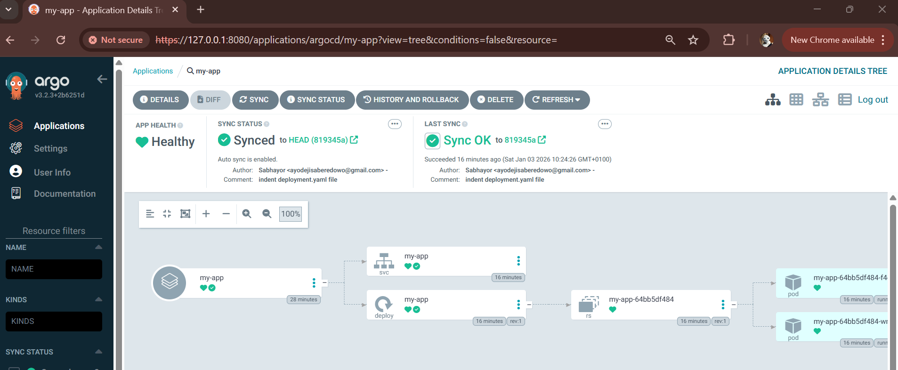

# Managing Application Configurations with Helm in ArgoCD

## Objective

Learn how to manage application configurations using **Helm** deployed and synchronized through **ArgoCD**, following GitOps best practices.

By the end of this guide, you will:

* Create a simple Helm chart
* Store it in a Git repository
* Deploy and manage the Helm-based application using ArgoCD

---

## Prerequisites

Ensure the following are already in place:

* A running Kubernetes cluster (EKS, kind, minikube, etc.)
* ArgoCD installed in the cluster
* `kubectl` configured to access the cluster
* `argocd` CLI installed and authenticated
* `helm` CLI installed
* A GitHub (or Git-compatible) repository

---

## Step 1: Create a Helm Chart

You can either create a new Helm chart or reuse an existing one. In this guide, we create a simple chart from scratch.

### 1.1 Generate a Helm Chart Skeleton

```bash
helm create my-app
```

This command generates a standard Helm chart structure.

### 1.2 Simplified Helm Chart Structure

For clarity, we will keep only the essential files:

```text
my-app/
├── Chart.yaml
├── values.yaml
├── templates/
│   ├── deployment.yaml
│   ├── service.yaml
│   └── ingress.yaml
```

Remove unnecessary template files (e.g., tests, helpers) if desired.

---

## Step 2: Define the Helm Chart Files

### 2.1 `Chart.yaml`

Defines metadata about the chart.

```yaml
apiVersion: v2
name: my-app
description: A simple Helm chart deployed via ArgoCD
type: application
version: 0.1.0
appVersion: "1.0"
```

---

### 2.2 `values.yaml`

Holds configurable values for the application.

```yaml
replicaCount: 2

image:
  repository: nginx
  tag: latest
  pullPolicy: IfNotPresent

service:
  type: ClusterIP
  port: 80

ingress:
  enabled: false
```

---

### 2.3 `templates/deployment.yaml`

```yaml
apiVersion: apps/v1
kind: Deployment
metadata:
  name: {{ .Release.Name }}
spec:
  replicas: {{ .Values.replicaCount }}
  selector:
    matchLabels:
      app: {{ .Release.Name }}
  template:
    metadata:
      labels:
        app: {{ .Release.Name }}
    spec:
      containers:
        - name: {{ .Release.Name }}
          image: "{{ .Values.image.repository }}:{{ .Values.image.tag }}"
          ports:
            - containerPort: 80
```

---

### 2.4 `templates/service.yaml`

```yaml
apiVersion: v1
kind: Service
metadata:
  name: {{ .Release.Name }}
spec:
  type: {{ .Values.service.type }}
  selector:
    app: {{ .Release.Name }}
  ports:
    - port: {{ .Values.service.port }}
      targetPort: 80
```

---

### 2.5 `templates/ingress.yaml`

```yaml
{{- if .Values.ingress.enabled }}
apiVersion: networking.k8s.io/v1
kind: Ingress
metadata:
  name: {{ .Release.Name }}
spec:
  rules:
    - host: my-app.local
      http:
        paths:
          - path: /
            pathType: Prefix
            backend:
              service:
                name: {{ .Release.Name }}
                port:
                  number: {{ .Values.service.port }}
{{- end }}
```

---

## Step 3: Push the Helm Chart to Git

Initialize a Git repository (or reuse an existing one):

```bash
git init
git add my-app
git commit -m "Add Helm chart for my-app"
git remote add origin https://github.com/<your-username>/argocd-helm-demo.git
git push -u origin main
```

---

## Step 4: Deploy the Helm Chart Using ArgoCD

### 4.1 Create an ArgoCD Application (CLI Method)

```bash
argocd app create my-app \
--repo https://github.com/Sabhayor/argocd-helm-application-deployment.git \
--path my-app \
--dest-server https://kubernetes.default.svc \
--dest-namespace default \
--sync-policy automated
```

Key parameters explained:

* `--repo`: Git repository containing the Helm chart
* `--path`: Path to the Helm chart directory
* `--dest-server`: Target Kubernetes cluster
* `--dest-namespace`: Namespace for deployment
* `--sync-policy automated`: Enables auto-sync


---

### 4.2 (Optional) Override Helm Values in ArgoCD

You can override Helm values directly from ArgoCD:

```bash
argocd app set my-app \
  --helm-set replicaCount=3
```

Alternatively, define a custom `values.yaml` under ArgoCD Application spec when using the UI.

---

## Step 5: Sync and Verify Deployment

### 5.1 Sync the Application

```bash
argocd app sync my-app
```

### 5.2 Check Application Status

```bash
argocd app get my-app
```

### 5.3 Verify Kubernetes Resources

```bash
kubectl get pods
kubectl get svc
```

You should see resources created and managed by ArgoCD, rendered from the Helm chart.

---

## Step 6: Configuration Management with Helm + ArgoCD

Key GitOps advantages:

* Configuration changes are made by editing `values.yaml` in Git
* ArgoCD continuously reconciles desired state
* Rollbacks are as simple as reverting a Git commit
* Helm templating provides flexible, reusable configuration

Example change:

```yaml
replicaCount: 4
```

Commit and push the change, and ArgoCD will automatically apply it.

---

## Cleanup (Optional)

```bash
argocd app delete my-app
```

